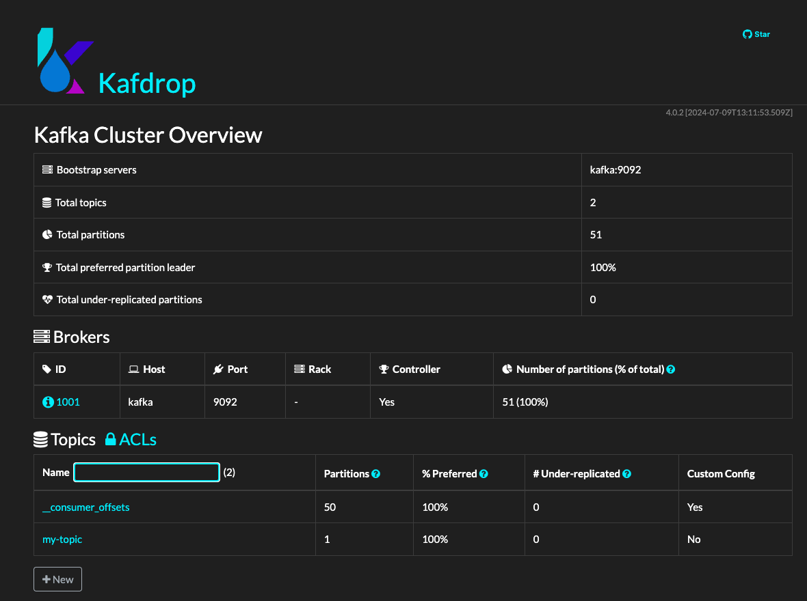

# Docker + NodeJS + Kafka (3 Brokers), Zookeeper, and Kafdrop

This repository provides `docker-compose.yml` and `docker-compose-replicate.yml` configurations for setting up a local Kafka environment with **Zookeeper**, **Kafka** (3 Brokers), and **Kafdrop**. This setup allows for managing and visualizing Kafka topics while integrating with **Node.js** applications.

## Overview

The services configured are:
- **Zookeeper**: Manages Kafka's distributed system state.
- **Kafka**: A distributed streaming platform for building real-time data pipelines and streaming apps.
- **Kafdrop**: A web-based UI that provides an interface for managing and visualizing Kafka topics and messages.

## Prerequisites

- **Docker**: Ensure that you have Docker installed on your system.
  - [Get Docker](https://www.docker.com/products/docker-desktop)
- **Docker Compose**: Ensure that Docker Compose is installed.
  - [Get Docker Compose](https://docs.docker.com/compose/install/)

## Services Overview

### Zookeeper
- Image: `bitnami/zookeeper:3.7.0`
- Port: `2181`
- Zookeeper is required by Kafka for managing cluster state.

### Kafka
- Image: `bitnami/kafka:2.8.0`
- Ports:
  - `9093`

### Kafdrop
- Image: `obsidiandynamics/kafdrop`
- Port: `9000`
- Kafdrop provides a UI for managing and visualizing Kafka topics.

## Getting Started

Run the following command to start Kafka, Zookeeper, and Kafdrop

### Start Kafka, Zookeeper, and Kafdrop

```bash
docker-compose up -d
```

Once all the services are running, you can access the Kafdrop UI by navigating to

http://localhost:9000



#### Purpose of Bitnami Folders
Bitnami provides ready-to-use Docker images for Kafka and Zookeeper, and they use the /bitnami/... directory in the container to store persistent data, including logs, configuration, and message data.


```
volumes:
  - ./bitnami/zookeeper:/bitnami/zookeeper
```

The ./bitnami folders are used to persist Kafka and Zookeeper data on your host machine, so the data is not lost if the containers are restarted or deleted.

##### Kafka Environment Variables Breakdown
- KAFKA_ZOOKEEPER_CONNECT=zookeeper:2181:

    This defines how the Kafka broker connects to Zookeeper, which is responsible for managing the metadata for the Kafka cluster.
    The format is <Zookeeper host>:<Zookeeper port>. In this case, it’s pointing to the Zookeeper container running on port 2181 in the Docker network.
- KAFKA_CREATE_TOPICS="kafka_topic_name:1:1":

    This automatically creates a topic when the Kafka broker starts.
    The format is <topic_name>:<number_of_partitions>:<replication_factor>.
      - Topic Name: kafka_topic_name.
      - Number of Partitions: 1.
      - Replication Factor: 1.
- KAFKA_CFG_AUTO_CREATE_TOPICS_ENABLE=true:

    Enables automatic topic creation if a non-existent topic is referenced. This is useful for testing and development but should be disabled in production environments to avoid accidental topic creation.

- KAFKA_CFG_LISTENER_SECURITY_PROTOCOL_MAP=CLIENT:PLAINTEXT,EXTERNAL:PLAINTEXT:

    This variable maps the listeners to a specific security protocol. In this case, both the CLIENT and EXTERNAL listeners use the PLAINTEXT protocol, meaning the communication is unencrypted and unauthenticated.

- KAFKA_CFG_LISTENERS=CLIENT://kafka:9092,EXTERNAL://0.0.0.0:9093:

  This variable defines where Kafka listens for incoming connections.
  CLIENT listener: Binds to kafka:9092, used for internal communication within Docker.
  EXTERNAL listener: Binds to 0.0.0.0:9093, making Kafka accessible on port 9093 for external clients outside Docker.

- KAFKA_CFG_ADVERTISED_LISTENERS=CLIENT://kafka:9092,EXTERNAL://localhost:9093:

  Advertised listeners tell Kafka clients (producers and consumers) how to connect to the broker.
  CLIENT: Advertised as kafka:9092 for internal Docker services.
  EXTERNAL: Advertised as localhost:9093 for external services (such as a Node.js app running outside Docker).

- KAFKA_INTER_BROKER_LISTENER_NAME=CLIENT:

  This defines the listener that Kafka brokers use for inter-broker communication. In this case, it’s set to CLIENT, meaning that brokers will communicate with each other using the CLIENT listener on port 9092.

- ALLOW_PLAINTEXT_LISTENER=yes:

  This enables the PLAINTEXT listener, which means that Kafka will accept unencrypted connections. It’s useful for development, but in production, you may want to configure SSL or SASL for encryption and authentication.


### Start the NodeJS Service

```
npm i
npm run start
```

### Use Curl Send Message

```bash
curl -X POST http://localhost:8080/api/send \
  -H "Content-Type: application/json" \
  -d '{"message": "test-message"}'
```


### Kafka Cluster (3 Brokers) Setup
This setup uses three Kafka brokers for high availability, fault tolerance, and topic replication. 

- Ports:
  - `9092`, `9093`, `9094` (for each broker)
- **Multiple Brokers**: Kafka is configured with 3 brokers (`kafka1`, `kafka2`, and `kafka3`) for fault tolerance and replication.
- **Replication**: Topics will be replicated across the 3 brokers for high availability.


### Kafka Client Configuration
To connect your Node.js app to the Kafka brokers, update the config.js file as shown below:

```js
class KafkaConfig {
  constructor() {
    this.kafka = new Kafka({
      clientId: "nodejs-kafka",
      // brokers: ["localhost:9093"],
      // Kafka (3 Brokers)
      brokers: ["localhost:9092", "localhost:9093", "localhost:9094"],
      connectionTimeout: 3000, // Timeout for establishing a connection
      retry: {
        initialRetryTime: 300, // Initial backoff delay
        retries: 10, // Number of retry attempts
      },
    });
```
### Run Kafka Cluster with Docker Compose
To bring up the Kafka cluster, run the following command with the provided docker-compose-replicate.yml file:

```bash
docker-compose -f docker-compose-replicate.yml up -d --remove-orphans
```
This will start the 3 Kafka brokers and any related services. You can then monitor the status and activity of Kafka brokers using Kafdrop, a Kafka web UI tool.

http://localhost:9000


This UI allows you to monitor topics, partitions, consumers, and broker status.


### Other Resources

[An open-source project by Conduktor.io](https://github.com/conduktor/kafka-stack-docker-compose)